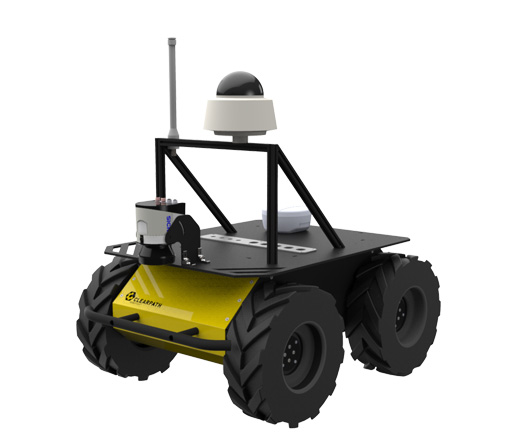

<a href="https://unige.it/en/">


</a>

# Software Architecture Project

## Group ID: Nav-06

## Project Members

|            Name            | Student ID |       Email Address       |
| :------------------------: | :--------: | :-----------------------: |
| Omotoye Shamsudeen Adekoya |  5066348   | adekoyaomotoye@gmail.com  |
|       Farzin Sarvari       |  5057724   | Sarvarifarzin94@gmail.com |
|      Amanzhol Raisov       |  4889656   |   cornytravel@gmail.com   |
|     Taha Hussain Raja      |  5046306   |    rajagenoa@gmail.com    |

<div align="center">
<h1>  Mobile Robot Navigation and Mapping </h1>


</div>

## Project Objectives

This project aims to design and implement a **_software architecture_** for the control of a mobile robot _(Husky Robot)_ to Navigate and Map an environment _(simulated or real-life)_. The Mobile Robot in question is a robot called **Husky Robot**, the robot is a _non-holonomic robot_ equipped with a LaserScan sensor for detecting an obstacle. A simulation environment is provided as a **Unity Scene** which is contained by the _husky robot_ and an environment with obstacles to navigate through, there is also a goal point that the robot is intended to navigate to. The control of the mobile robot to perform the aforementioned task is going to be done through ROS packages, therefore the ROS packages and how they interact through interfaces to perform the goal is what this project is going to focus on (basically investing the software architecture design for the ROS packages).

Enumerated goals the software architecture is intended to achieve with the robot (simulated and real-life)

- Create a 3D Map (SLAM)
- Implement an Exploration Logic to reach a target in the environment.

For more information about the project requirements, [Click Here](Docs/SofAR-Assignments-2020-2021.pdf).

**NOTE**: **_some objectives have been changed because of simulation limitations_**

## System Architectures

Three different system architecture was implemented for this project each with their different pros and cons.

1. Reactive Navigation (SLAM), _Dijkstra's algorithm for Navigation_
1. MapBased Navigation, _Dijkstra's algorithm for Navigation_

<div align="center">
<h3> Reactive Navigation (SLAM) </h3>

</div>

The architecture implements SLAM (Simultaneous Localization and Mapping) to navigate the robot from its initial pose to the target location. The SLAM package creates a map while moving through the unknown environment and then from the map created by the SLAM package, the robot can localize itself and use Dijkstra's algorithm to figure out the best path to take to the goal point base on the knowledge gathered from the map creation.
The architecture is split into two main components; the **Unity Scene** component, where the robot that is being controlled is simulated, and the **ROS** component where the control of the simulated robot is taking place.

#### Unity Scene Component

The unity scene component is a simulation environment that is very similar to _Gazebo_ only that this Simulator is more general than Gazebo. Asides from simulating an environment for ROS development (which only just got supported recently), it is used for things like multiplatform game development, VR and AR application development, etc. In this component, there are two subcomponents, the _mobile robot, and the goal planner_. The unity scene publishes the **Robot Pose** (`/odometry_frame`) and **Laser Sensor Reading** (`/laser_scan`) from the Robot Model in the scene. The component implements a Publisher interface to send a ROS message **LaserScan** through the `/laser_scan` topic and a **Pose** message through the `/odometry_frame` topic. The Goal planner of the unity scene uses a slightly different interface; it uses an **_actionlib client_**. The two Interfaces only differ in concept because it also publishes the message just like a publisher, only that for the actionlib client, it follows the client-server concept, in which the client sends a request to a server and expects a response from the server. The goal planner sends a **geometry_msgs/PoseStamped** through the `move_base_simple/goal` topic. The only input message to the Unity Scene is a **geometry_msgs/Twist** message through the `/cmd_vel` topic. This message is sent from the ROS component to control the velocity of the Mobile Robot for the navigation of the robot. The Unity Scene Simulation environment was developed by [TheEngineRoom-Unige Lab](https://github.com/TheEngineRoom-UniGe/SofAR-Mobile-Robot-Navigation.git) for this project, the task for us is to create a ROS architecture to interact with the simulation environment to perform a specific task. So basically there's nothing to change from the Simulation other than interacting with it.

#### The ROS Component (Robot Operating System)

The ROS component consists of the seven sub-component as follow

- Odometry Publisher
- Husky Robot Description
- Joint State Publisher
- Robot State Publisher
- Slam-toolbox (SLAM)
- RViz (Data Visualization)
- MoveBase (Dijkstra's Navigation)

#### Odometry Publisher

This ROS node takes the _Robot Pose_ message coming from the `/odometry_frame` topic and uses it to create a transformation between `/odom` and `/base_link`, it then takes the transformation message and sends it to the `/tf` topic.

#### Husky Robot Description

The Husky Robot Description is a **URDF (Universal Robot Description Format)** model which is a collection of files that describe a robot's physical description (_robot frame transformations, the physical appearance of the robot, etc..._) to ROS. The component publishes this information into a ros parameter server for other nodes to read from when robot transformations and appearance are required. The component was gotten from a ros package from Husky Robot official [Github Page](https://github.com/husky/husky.git) that is added as a submodule to this GitHub.

#### Joint State Publisher

This is a ROS inbuilt package that reads the robot_description parameter from the parameter server, finds all of the non-fixed joints, and publishes a JointState message with all those joints defined. [ROS Wiki](http://wiki.ros.org/joint_state_publisher). The JointState message is used by the Robot state publisher to determine the transformation between the robot joints.

#### Robot State Publisher

The is another ROS inbuild package that helps to publish the state of the robot to `/tf`. This package subscribes to joint states of the robot from the joint state publisher and publishes the 3D pose of each link using the kinematic representation from the URDF model. It publishes the state of a robot to tf2. Once the state gets published, it is available to all components in the system that also use tf2. [ROS Wiki](http://wiki.ros.org/robot_state_publisher)

#### slam_toolbox (SLAM)

Simultaneous localization and mapping (SLAM) is the computational problem of constructing or updating a map of an unknown environment while simultaneously keeping track of an agent's location within it. There are several algorithms known for solving it, at least approximately, in tractable time for certain environments. Popular approximate solution methods include the particle filter, extended Kalman filter, Covariance intersection, and GraphSLAM. [Wikipedia](https://en.wikipedia.org/wiki/Simultaneous_localization_and_mapping). There are several existing open-source laser scanner SLAM algorithm ROS packages for performing SLAM available for use, this includes GMapping, Karto, Cartographer, and Hector. The reason for picking slam_toolbox over all of these options is the fact that slam_toolbox is more robust, most modern, and has strong backing from the ROS community.
This package, slam_toolbox is open-source under an LGPLv2.1 at [SteveMacenski](https://github.com/SteveMacenski/slam_toolbox.git) and is available in every current ROS distribution. It was
also selected as the new default SLAM vendor in ROS 2, the second generation of robot
operating systems, replacing GMapping. SLAM Toolbox was integrated into the new ROS 2
Navigation2 project, providing real-time positioning in dynamic environments for autonomous
navigation (Macenski, Martín, et al., 2020). It has been shown to map spaces as large as
24,000 m2 [The Journal of Open Source Software](https://joss.theoj.org/papers/10.21105/joss.02783)
This package subscribes to `sensor_msgs/LaserScan` in the `/laser_scan` topic and tf message in the`/tf` and uses the message to generate a `nav_msgs/OccupancyGrid` and publishes it to the `/map` topic message. It also helps the robot Localize itself to the environment.

#### RViz (Data Visualization)

This is a ROS inbuilt GUI tool for visualizing all the types of ROS messages published through ROS. The component is used to view the `nav_msgs/OccupancyGrid`message published through the `/map` topic, the robot model, the odometry of the robot, and much more. It is used to visualize all the ros messages publish within the Architecture. [ROS Wiki](http://wiki.ros.org/rviz)

#### MoveBase (Dijkstra's Navigation)

The move_base package provides an implementation of an action (see the [actionlib](https://wiki.ros.org/actionlib) package) that, given a goal in the world, will attempt to reach it with a mobile base. The move_base node links together a global and local planner to accomplish its global navigation task. It supports any global planner adhering to the `nav_core::BaseGlobalPlanner` interface specified in the nav_core package and any local planner adhering to the `nav_core::BaseLocalPlanner` interface specified in the nav_core package. The move_base node also maintains two costmaps, one for the global planner, and one for a local planner (see the [costmap_2d](https://wiki.ros.org/costmap_2d) package) that are used to accomplish navigation tasks. [ROS Wiki](http://wiki.ros.org/move_base). The package is the package that is used to accomplish the navigation task, a goal of a target pose is published from the Unity Component and the move_base server sends the required `Twist` message to the `cmd_vel` topic to move the robot.

> For each of the external packages, the parameters of the package have been tuned specifically for use on this robot and various launch files have been created to easily launch the required parts of the packages.

<div align="center">
<h3> MapBased Navigation </h3>

</div>

This architecture uses the already created map from the SLAM architecture to navigate the known environment. For this architecture, the SLAM package is no longer required because the map is already known and another package can be used to Localize the robot on the map with [Monte Carlo Localization](https://en.wikipedia.org/wiki/Monte_Carlo_localization). The Unity Component remains the same as that of SLAM navigation. A detailed description of the two added components is attached below.

#### Map Server

map_server provides the map_server ROS Node, which offers map data as a ROS Service. It also provides the map_saver command-line utility, which allows dynamically generated maps to be saved to file. [ROS Wiki](http://wiki.ros.org/map_server). The map_saver node is the node that is used to save the map that is generated from the SLAM package. The map is saved as a .pgm and .yaml file the .pgm file is the image of the map and in the .yaml file, some information about the map like origin, the path to map image, etc is stored here. The map_server node is what would then be quired when the map data is required by amcl, rviz, etc...

#### AMCL

amcl is a probabilistic localization system for a robot moving in 2D. It implements the adaptive (or KLD-sampling) Monte Carlo localization approach (as described by Dieter Fox), which uses a particle filter to track the pose of a robot against a known map. [ROS Wiki](http://wiki.ros.org/amcl). The package request the map data from the map_server node and uses this data to localize the robot in the environment

## Installation

> All the external ROS packages included in this project are meant for ROS Noetic Ninjemys, therefore the installation should be done on a machine with ROS Noetic Distro.

The project is intended to be done with two PCs, one Windows pc running Unity and an Ubuntu Pc running ROS, however, there are ways around these to make both of them run on one pc. Also, the two PCs must be connected to the same internet.

- Ubuntu Virtual Machine: Install an ubuntu virtual machine and then on the virtual machine install ROS and follow the steps below to install all the ROS packages required. **Note**; for the network adapter the bridge network option has to be selected.
- Docker Container: To use a docker container to run the ubuntu side of the project, a tutorial provided by [Marco Gabriele Fedozzi](https://github.com/hypothe) can be followed by [clicking here](https://hub.docker.com/r/hypothe/sofar_ros) and then follow the instructions below for the installation of the ROS package
- A final option is to use **wslg** (_Windows Subsystem for Linux GUI_). Follow the installation instruction by [clicking here](https://github.com/microsoft/wslg) and then follow the instructions below for the installation of the ROS package. _keep in mind that Windows 11 is required to run wslg_

### UNITY INSTALLATION (WINDOWS)

- Visit https://unity3d.com/get-unity/download and download Unity Hub
  Through the Hub, install Unity 2020.2.2 (the version for which the projects have been developed) or later. Beware that later versions (eg. Unity 2021.1.x) may be incompatible with the projects
  ROS VERSION USED FOR THE PROJECT: ROS Noetic

- Visit https://github.com/TheEngineRoom-UniGe/SofAR-Mobile-Robot-Navigation to download the Unity project folder, extract it, then open Unity Hub and ADD the project to your projects list using the associated button.
- Open the Ubuntu system and enter the command below to retrieve the IP_Address of the Ubuntu system
  - ```bash
      ipconfig
    ```
  - copy the IP address from the **inet** section
- Open the Unity project
  In the bar on top of the screen, open the 'Robotics/ROS settings' tab and replace the 'ROS IP Address' with the IP of the machine running ROS that was just copied.

### ROS INSTALLATION (UBUNTU)

First, you create a folder for your catkin workspace

```bash
mkdir -p ~/sofar_ws/src
```

Clone the ROS Package repositories

for mobile_robot_navigation_project package

```bash
cd ~/sofar_ws/src
git clone --recurse-submodules https://github.com/Omotoye/Mobile-Robot-Navigation-and-Mapping.git     # this will cause it to clone the submodule together with the main repo.
```

for slam-toolbox package

```bash
cd ~/sofar_ws/src
git clone https://github.com/SteveMacenski/slam_toolbox.git
cd slam_toolbox
git checkout noetic-devel # to switch to the noetic branch
```

for installing all the ROS dependencies

```bash
cd ~/sofar_ws
rosdep install -q -y -r --from-paths src --ignore-src
```

for the navigation stack, just in case the rosdep doesn't catch that

```bash
sudo apt-get install ros-noetic-navigation
```

Once the package has been successfully cloned, you then build the workspace

```bash
source /opt/ros/noetic/setup.bash
cd ~/sofar_ws/
catkin_make
```

All required installation is now complete

## System Testing and Result

### How to Launch the Package

**Note**; before launching the packages, be sure all the package above has been compiled successfully

for launching the ROS part, several launch files have been created to launch all the required packages for a specific architecture.

#### For Reactive Navigation

1. on UBUNTU:
   - Open the 'mobile_robot_navigation_project' package, then navigate to config folder `Mobile-Robot-Navigation-and-Mapping/mobile_robot_navigation_project/config` and open the params.YAML file. Under ROS_IP, insert the IP address of the Ubuntu machine.
     To start communication with Unity run the launch file below.

```bash
roslaunch mobile_robot_navigation_project navigation.launch
```

_(ensure the server communication is up and running, you should see the following line in the terminal 'Starting server on YOUR IP:10000')_

2. on WINDOWS:

   - If the previous steps have been successful, you should be able to enter Editor mode (via the Play button) and play the simulation.

   - If the communication is running correctly, on UBUNTU you can echo the topics that are being exchanged between ROS and Unity.

3. on UBUNTU:
   - A launch file has been created for launching **husky robot description**, **joint_state_publisher**, **robot_state_pulisher**, **slam_toolbox**, **move_base** and **rviz**.
   - All the required configuration files for each of these packages have been stored in separate files and would simply be called by the launch file.
   - The run the launch file enter the command below

```bash
roslaunch mobile_robot_navigation_project mapless_nav.launch
```

4. on WINDOWS:

   - After all, packages have been launched properly, click on a button in the Unity Scene that says **"Move!"**, this would send a goal message to the ROS Component containing the pose of the target

5. on UBUNTU:
   - the map generated from this process can be saved by using the command below, this map would be used for the mapbased_navigation architecture.

```bash
rosrun map_server map_saver -f map
```

From here, enjoy navigating with the architecture, a new goal position can be set from rviz as well by clicking on the 2D Nav Goal button.

#### For MapBased Navigation

For this architecture, the step 1 and 2 of the Reactive Navigation remains the same.

3. on UBUNTU:
   - A launch file has been created for launching **husky robot description, joint state publisher, robot state publisher, map_server, amcl, and rviz**
   - To run the launch file, enter the command below.

```bash
roslaunch mobile_robot_navigation_project mapbased_nav.launch
```

Some more work is required for this architecture because initially, the robot has no idea where it is located on the map, therefore we have to set the pose by using the 2D Pose Estimate button in rviz.

> **how to know that the correct pose was selected**; the odom frame would be in the same point (or very close) where the map frame is located and then the obstacle detected by the laser scan would align with the actual obstacle in the map

From here the step 4 from the reactive navigation can be repeated to navigate the robot to some goal point.

## Result

## Recommendations
